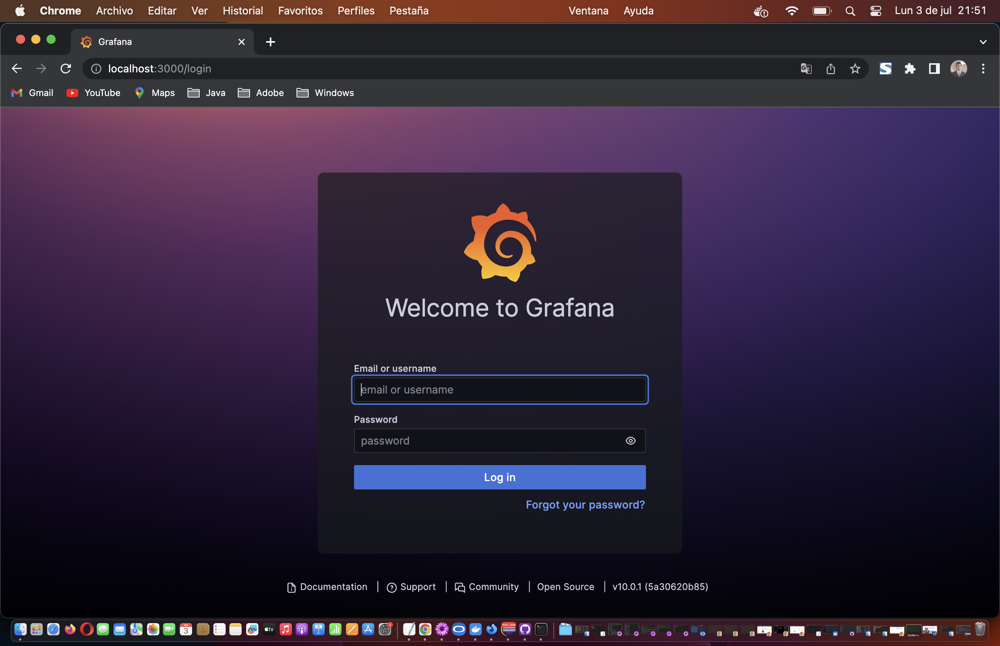
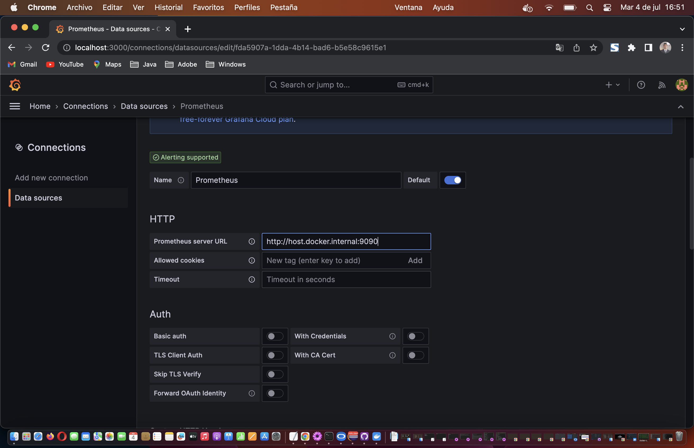
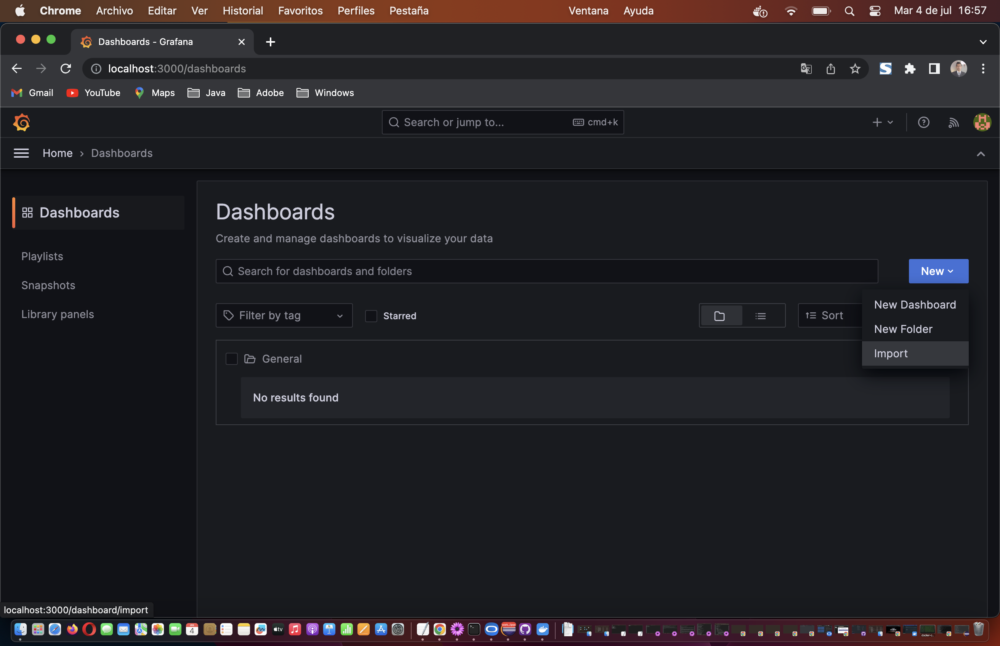
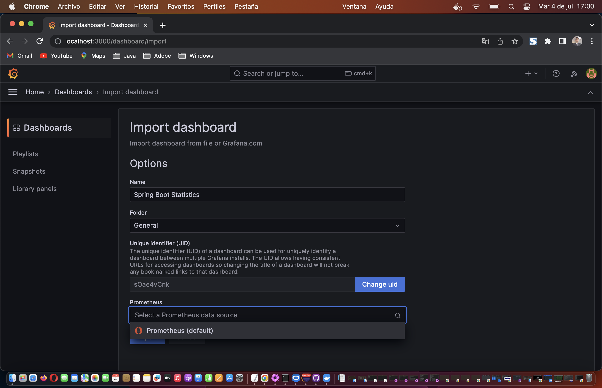
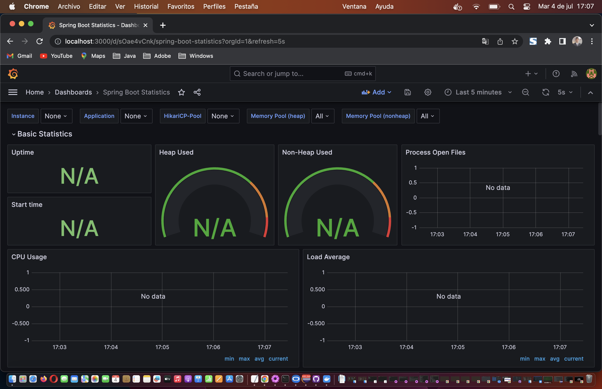
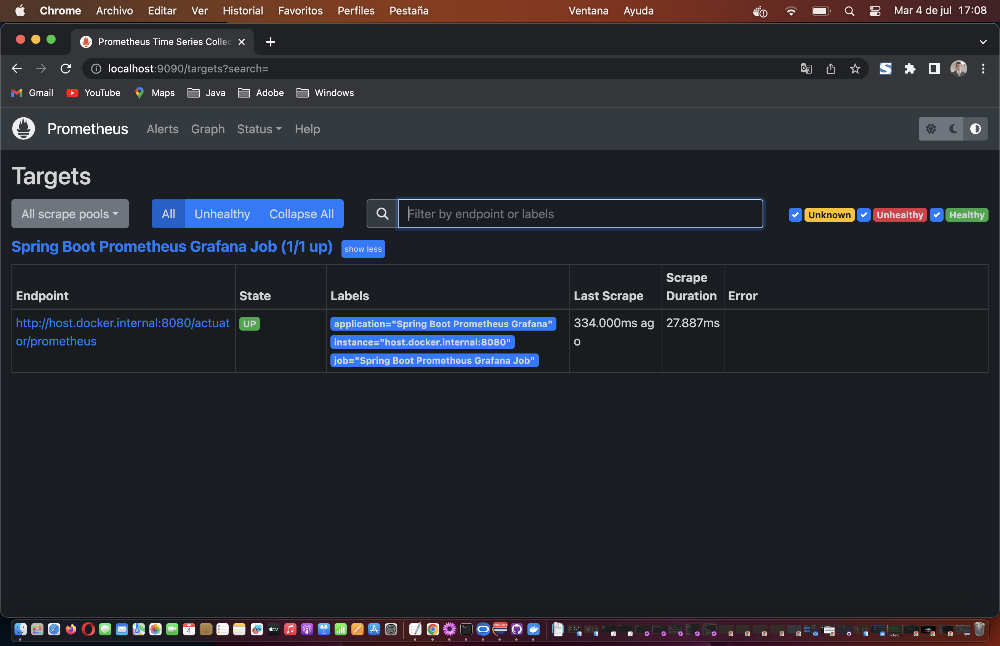

# SPRING BOOT PROMETHEUS GRAFANA

## Synopsis

The project is a Spring Boot Application that sends metrics to Prometheus and in Grafana shows the graphs.

This application was based on the following links:

- [Monitoring Spring Boot Application with Prometheus and Grafana](https://refactorfirst.com/spring-boot-prometheus-grafana)

- And the above link has the following GitHub link, where I copied the dashboard, Spring Boot Statistics Dashboard.json:
  [grafana-prometheus](https://github.com/amrutprabhu/grafana-prometheus)
  
- [How To Monitor a Spring Boot App With Prometheus and Grafana](https://betterprogramming.pub/how-to-monitor-a-spring-boot-app-with-prometheus-and-grafana-22e2338f97fc)

- With the above link I based my `docker-compose.yml` and `prometheus.yaml`.

- And the above link has the following GitHub link:
  [springboot-monitoring-demo](https://github.com/kirshiyin89/springboot-monitoring-demo)

## Motivation

I wanted to do a Spring Boot Application, that shows metrics using Prometheus and Grafana.

## Pre Requirements

- If you have Prometheus and Grafana installed you need to run them.
- Otherwise you need docker-compose installed so that you can run Prometheus and Grafana as docker containers.
- If you are using MacOS uncomment the following from docker-compose.yml instead of localhost:
      -  GF_SERVER_DOMAIN=docker.for.mac.localhost
- If you are using Macos uncomment the following from prometheus.yml instead of localhost:
      - targets: ['docker.for.mac.localhost:8080']

## Running the application

1. Open a terminal and go to the path `/spring-boot-prometheus-grafana/docker/metrics/`

2. Execute: `docker-compose up`
   
   You should see something like this:
   
   
3. You should see that some folders were created in the grafana folder:

   
   
4. Open a browser and type: [http://docker.for.mac.localhost:9090](http://docker.for.mac.localhost:9090)

   You should see something like this:
   
   
5. Go to the Status menu and select Targets:
   
   

6. You should see something like this:

   
   
   The Endpoint State is DOWN. Because we haven't started the Spring Boot application.
   
7. Open a browser and type: [http://docker.for.mac.localhost:3000](http://docker.for.mac.localhost:3000)

   You should see something like this:
   
   
   Type in Email or username: `admin`
   
   Password: `admin`
   
8. It'll ask for new password:

   
   
   You can type `admin` again.
   
   
   
9. Connect Grafana to Prometheus.

   Go to the left menu and select Connections -> Data sources
   
   
   
10. Click on Add data source:

   
   
11. Select Prometheus:

   
   
12. Prometheus settings:

   
   
13. Fill in the blank "Prometheus server URL" with `http://docker.for.mac.localhost:9090`
    
14. Go to the end of the page and click on "Save & test":

    If you fill the blank with: `http://localhost:9090` in MacOS, you'll receive:
    
    Post "http://localhost:9090/api/v1/query": dial tcp 127.0.0.1:9090: connect: connection refused - There was an error returned querying the Prometheus API.
   
15. Then you should see this:

    

    Successfully queried the Prometheus API.
    Next, you can start to visualize data by building a dashboard, or by querying data in the Explore view.
    
16. Now import the dashboard to Grafana:

    Go to the left menu and select Dashboards
    
    Then in the right button click on New -> import
    
    
    
    
    
17. Click on "Upload dashboard JSON file", and select the dashboard on `/spring-boot-prometheus-grafana/docker/metrics/grafana/dashboard/Spring Boot Statistics Dashboard.json`

18 Then you should see this:

   
   
19. Select Prometheus in he combo box, and click on Import button:

    You'll see empty graphs:
    
    
    
20. Start the Spring Boot application, so that you can start seeing the metrics and to see the Prometheus Endpoint State to UP:

ECLIPSE CONSOLE:
----------------
```

  .   ____          _            __ _ _
 /\\ / ___'_ __ _ _(_)_ __  __ _ \ \ \ \
( ( )\___ | '_ | '_| | '_ \/ _` | \ \ \ \
 \\/  ___)| |_)| | | | | || (_| |  ) ) ) )
  '  |____| .__|_| |_|_| |_\__, | / / / /
 =========|_|==============|___/=/_/_/_/
 :: Spring Boot ::                (v3.1.1)

2023-07-03T23:18:43.816-06:00  INFO 36149 --- [           main] c.SpringBootPrometheusGrafanaApplication : Starting SpringBootPrometheusGrafanaApplication using Java 17.0.7 with PID 36149 (/Users/rac/Documents/GitHub/spring-boot-prometheus-grafana/target/classes started by rac in /Users/rac/Documents/GitHub/spring-boot-prometheus-grafana)
2023-07-03T23:18:43.817-06:00  INFO 36149 --- [           main] c.SpringBootPrometheusGrafanaApplication : No active profile set, falling back to 1 default profile: "default"
2023-07-03T23:18:44.119-06:00  INFO 36149 --- [           main] .s.d.r.c.RepositoryConfigurationDelegate : Bootstrapping Spring Data JPA repositories in DEFAULT mode.
2023-07-03T23:18:44.127-06:00  INFO 36149 --- [           main] .s.d.r.c.RepositoryConfigurationDelegate : Finished Spring Data repository scanning in 5 ms. Found 0 JPA repository interfaces.
2023-07-03T23:18:44.310-06:00  INFO 36149 --- [           main] o.s.b.w.embedded.tomcat.TomcatWebServer  : Tomcat initialized with port(s): 8080 (http)
2023-07-03T23:18:44.314-06:00  INFO 36149 --- [           main] o.apache.catalina.core.StandardService   : Starting service [Tomcat]
2023-07-03T23:18:44.314-06:00  INFO 36149 --- [           main] o.apache.catalina.core.StandardEngine    : Starting Servlet engine: [Apache Tomcat/10.1.10]
2023-07-03T23:18:44.350-06:00  INFO 36149 --- [           main] o.a.c.c.C.[Tomcat].[localhost].[/]       : Initializing Spring embedded WebApplicationContext
2023-07-03T23:18:44.350-06:00  INFO 36149 --- [           main] w.s.c.ServletWebServerApplicationContext : Root WebApplicationContext: initialization completed in 515 ms
2023-07-03T23:18:44.434-06:00  INFO 36149 --- [           main] com.zaxxer.hikari.HikariDataSource       : HikariPool-1 - Starting...
2023-07-03T23:18:44.516-06:00  INFO 36149 --- [           main] com.zaxxer.hikari.pool.HikariPool        : HikariPool-1 - Added connection conn0: url=jdbc:h2:mem:edd97e6d-bb88-4950-bd86-27bbb754c6ca user=SA
2023-07-03T23:18:44.516-06:00  INFO 36149 --- [           main] com.zaxxer.hikari.HikariDataSource       : HikariPool-1 - Start completed.
2023-07-03T23:18:44.534-06:00  INFO 36149 --- [           main] o.hibernate.jpa.internal.util.LogHelper  : HHH000204: Processing PersistenceUnitInfo [name: default]
2023-07-03T23:18:44.554-06:00  INFO 36149 --- [           main] org.hibernate.Version                    : HHH000412: Hibernate ORM core version 6.2.5.Final
2023-07-03T23:18:44.555-06:00  INFO 36149 --- [           main] org.hibernate.cfg.Environment            : HHH000406: Using bytecode reflection optimizer
2023-07-03T23:18:44.612-06:00  INFO 36149 --- [           main] o.h.b.i.BytecodeProviderInitiator        : HHH000021: Bytecode provider name : bytebuddy
2023-07-03T23:18:44.658-06:00  INFO 36149 --- [           main] o.s.o.j.p.SpringPersistenceUnitInfo      : No LoadTimeWeaver setup: ignoring JPA class transformer
2023-07-03T23:18:44.712-06:00  INFO 36149 --- [           main] o.h.b.i.BytecodeProviderInitiator        : HHH000021: Bytecode provider name : bytebuddy
2023-07-03T23:18:44.795-06:00  INFO 36149 --- [           main] o.h.e.t.j.p.i.JtaPlatformInitiator       : HHH000490: Using JtaPlatform implementation: [org.hibernate.engine.transaction.jta.platform.internal.NoJtaPlatform]
2023-07-03T23:18:44.798-06:00  INFO 36149 --- [           main] j.LocalContainerEntityManagerFactoryBean : Initialized JPA EntityManagerFactory for persistence unit 'default'
2023-07-03T23:18:44.814-06:00  WARN 36149 --- [           main] JpaBaseConfiguration$JpaWebConfiguration : spring.jpa.open-in-view is enabled by default. Therefore, database queries may be performed during view rendering. Explicitly configure spring.jpa.open-in-view to disable this warning
2023-07-03T23:18:45.025-06:00  INFO 36149 --- [           main] o.s.b.a.e.web.EndpointLinksResolver      : Exposing 1 endpoint(s) beneath base path '/actuator'
2023-07-03T23:18:45.060-06:00  INFO 36149 --- [           main] o.s.b.w.embedded.tomcat.TomcatWebServer  : Tomcat started on port(s): 8080 (http) with context path ''
2023-07-03T23:18:45.068-06:00  INFO 36149 --- [           main] c.SpringBootPrometheusGrafanaApplication : Started SpringBootPrometheusGrafanaApplication in 1.384 seconds (process running for 6.639)
2023-07-03T23:18:46.010-06:00  INFO 36149 --- [nio-8080-exec-1] o.a.c.c.C.[Tomcat].[localhost].[/]       : Initializing Spring DispatcherServlet 'dispatcherServlet'
2023-07-03T23:18:46.010-06:00  INFO 36149 --- [nio-8080-exec-1] o.s.web.servlet.DispatcherServlet        : Initializing Servlet 'dispatcherServlet'
2023-07-03T23:18:46.012-06:00  INFO 36149 --- [nio-8080-exec-1] o.s.web.servlet.DispatcherServlet        : Completed initialization in 2 ms 

```

21. Refresh the browser where you have Prometheus:

    [http://docker.for.mac.localhost:9090](http://docker.for.mac.localhost:9090)

    

22. Refresh the browser wher you have Grafana: 
    
    [http://docker.for.mac.localhost:3000/d/sOae4vCnk/spring-boot-statistics?orgId=1&refresh=5s](http://docker.for.mac.localhost:3000/d/sOae4vCnk/spring-boot-statistics?orgId=1&refresh=5s0)

    

23. Now that you have your application up and running, you can check the metrics sent to Prometheus:

    [http://docker.for.mac.localhost:8080/actuator/prometheus](http://docker.for.mac.localhost:8080/actuator/prometheus)

    

## Notes

- By default, a Spring Boot application exposes JVM and HTTP request metrics, among other things. 

- The following link helped me to avoid errors because of MacOS:
[localhost not working on Mac](https://stackoverflow.com/questions/45538299/localhost-not-working-in-docker-for-mac)

## Bibliography

[Monitoring Springboot Applications with Prometheus and Asserts](https://www.asserts.ai/blog/monitoring-springboot-applications-with-asserts/)

## License

All work is under Apache 2.0 license